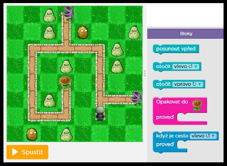
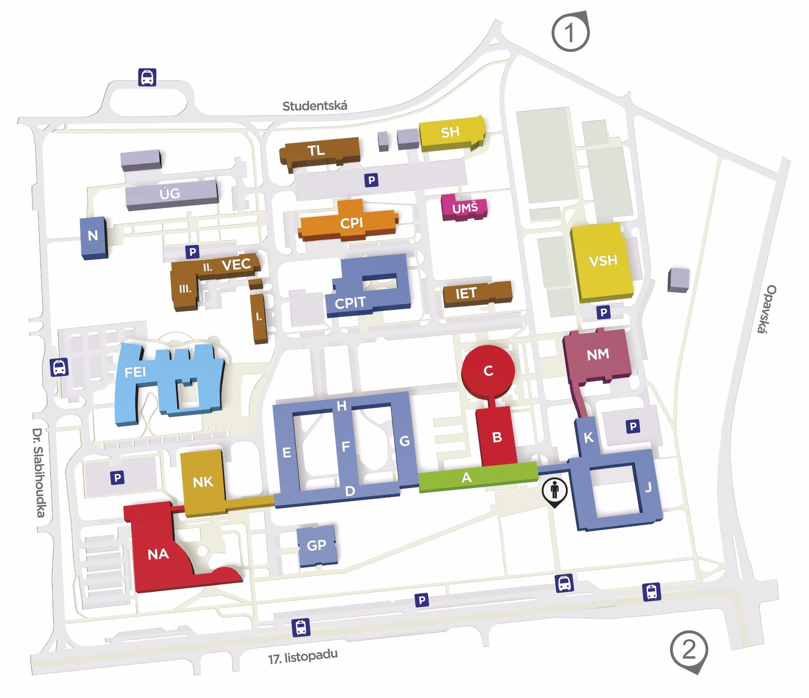

<h1 style="text-align: center;"> Vítejte! </h1>

[Katedra informatiky na VŠB-TUO](https://katedrainformatiky.cz/) pořádá kroužek programování, který je veden zábavnou formou a děti si vyzkoušejí základy tvorby programů v přívětivém grafickém rozhraní [code.org](http://code.org/). Kroužek je veden zkušenými pedagogy z Katedry informatiky a studenty pod jejich vedením. Každoročně jsou pořádány tři kroužky:
- první pro začátečníky, zaměžený na základy algoritmizace a seznámení s JavaScriptem, 
- druhý pro mírně pokročilé studenty, kde již přecházíme na HTML+JavaScript
- a třetí je kroužek pro pokročilejší, kde se studenti seznámí s jazykem Java, vývojovým prostředím Eclipse (volně dostupné z [eclipse.org](https://www.eclipse.org/)) a základy Objektově Orientovaného programování.

Všechny kroužky jsou vhodné pro děti ve věku 10-18 let.

#### KDE

Areál VŠB, budova Nová FEI. Místnosti jsou uvedeny u konkrétních kroužků.

#### CENA

2000Kč za rok

#### Informace a registrace do kroužků

* [Začátečníci (čtvrtek 14:30)](https://www.zlepsisitechniku.vsb.cz/program/929)
* [Začátečníci (čtvrtek 16:00)](https://www.zlepsisitechniku.vsb.cz/program/945)
* [Začátečníci (pátek 15:00)](https://www.zlepsisitechniku.vsb.cz/program/930)
* [Pokročilí (čtvrtek 14:30)](https://www.zlepsisitechniku.vsb.cz/program/928)
* [Pokročilí (čtvrtek 16:00)](https://www.zlepsisitechniku.vsb.cz/program/931)
* [Pokročilí - Java (čtvrtek 15:30)](https://www.zlepsisitechniku.vsb.cz/program/934)

#### Mapa

[Všechny mapy areálu VŠB](https://www.vsb.cz/cs/o-univerzite/kontakty-mapy-parkovani/mapy-arealu)